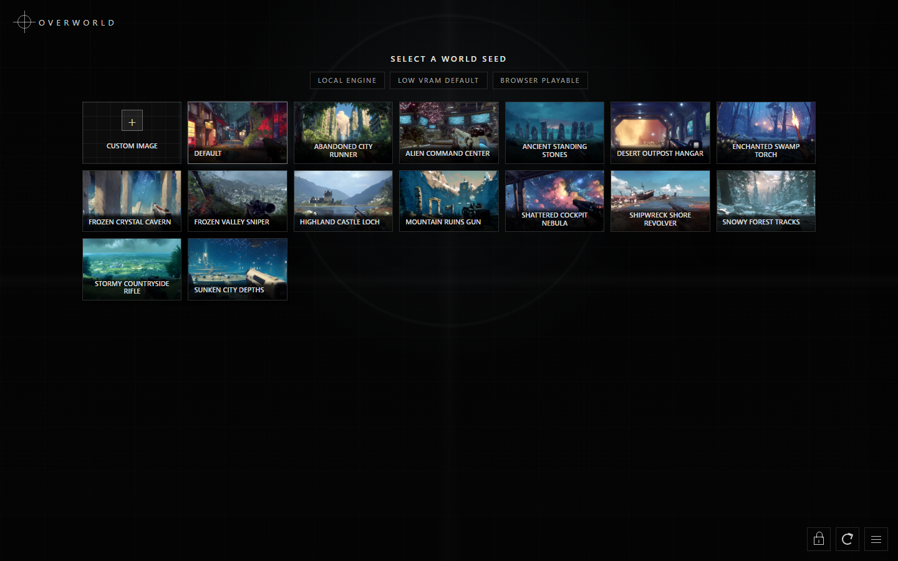

# Overworld

Overworld is a local, browser-playable AI world model demo for Pinokio. Pick a seed image, wait for the engine to initialize, then move through the generated world with normal game controls.

This launcher uses Overworld's Biome server components with a minimal web game UI. The default profile is the lowest VRAM option and is prepared during install so the first launch can reuse local model and compile caches.

# License

- Biome: https://github.com/Overworldai/Biome
- World Engine: https://github.com/Overworldai/world_engine

The Overworld world engine and Biome server are GPL licensed.

## Screenshots




## How To Use

1. Click **Install** in Pinokio.
2. Click **Start**.
3. Click **Play** when Pinokio opens the local web UI.
4. Choose an example seed image, or drag in your own image.
5. Use **WASD** to move, point the mouse to look, **Shift** to move faster, and **Space** for the jump/action control.

The default install prepares **Low VRAM 360p INT8**. Other profiles can be selected inside the app; the first run of a new profile may take longer while the model loads and Torch/Triton caches are built.

## Profiles

| Profile | Model | Quantization | Estimated VRAM |
| --- | --- | --- | --- |
| Low VRAM 360p INT8 | `Overworld/Waypoint-1.5-1B-360P` | `intw8a8` | 8-10 GB |
| 360p BF16 | `Overworld/Waypoint-1.5-1B-360P` | none | 12-14 GB |
| 720p INT8 | `Overworld/Waypoint-1.5-1B` | `intw8a8` | 14-16 GB |
| 720p BF16 | `Overworld/Waypoint-1.5-1B` | none | 18-20 GB |

The default 360p model download is about 3.7 GB. Actual disk usage is higher after Python packages, CUDA/PyTorch dependencies, Hugging Face cache files, and compiled kernel caches are created.

## Controls

- **W/A/S/D**: move
- **Mouse**: look around
- **Shift**: faster movement
- **Space**: jump/action
- **Lock icon**: capture mouse pointer
- **Reset icon**: reset the current world state
- **Menu icon**: open profile, seed, upload, and log controls

## API

The local server exposes HTTP endpoints and a WebSocket stream at the URL shown by Pinokio.

### JavaScript

```js
const ws = new WebSocket("ws://127.0.0.1:PORT/ws")
ws.binaryType = "arraybuffer"

ws.onopen = () => {
  ws.send(JSON.stringify({
    type: "init",
    req_id: "1",
    model: "Overworld/Waypoint-1.5-1B-360P",
    quant: "intw8a8",
    seed_image_data: "<base64 jpeg>",
    seed_filename: "default.jpg",
    scene_authoring: false,
    action_logging: false,
    video_recording: false,
    cap_inference_fps: true
  }))
}

ws.send(JSON.stringify({
  type: "control",
  buttons: ["W"],
  mouse_dx: 0,
  mouse_dy: 0,
  ts: performance.now()
}))
```

### Python

```python
import asyncio
import json
import websockets

async def main():
    async with websockets.connect("ws://127.0.0.1:PORT/ws") as ws:
        await ws.send(json.dumps({
            "type": "control",
            "buttons": ["W"],
            "mouse_dx": 0,
            "mouse_dy": 0,
            "ts": 0,
        }))

asyncio.run(main())
```

### Curl

```bash
curl http://127.0.0.1:PORT/health
curl http://127.0.0.1:PORT/api/model-info/Overworld/Waypoint-1.5-1B-360P
```

Use a WebSocket client for `/ws`; plain curl cannot drive the live frame stream.
